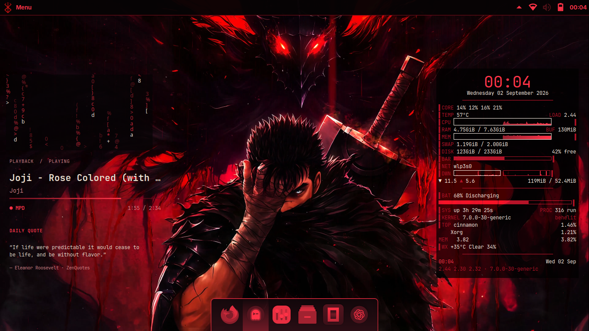
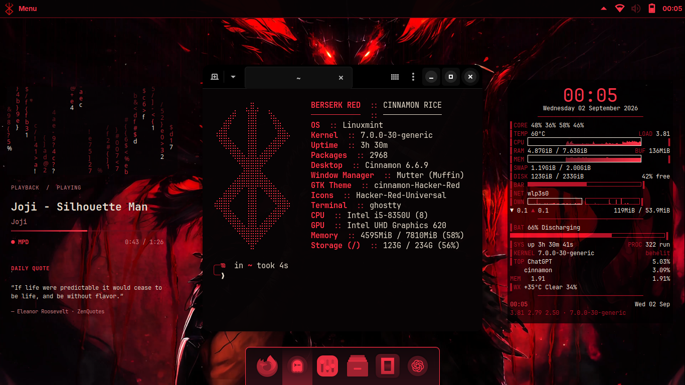

# Berserk Hacker Red Cinnamon

This is my black and red Cinnamon desktop setup for Linux Mint.



It includes:

- Cinnamon and GTK themes
- red app, folder and file icons
- red cursor and window buttons
- Cinnamenu and panel styling
- Conky, music, white-headed Matrix rain and quote widgets
- Rofi launcher and power menu
- Plank dock
- Ghostty, Neofetch, Starship and CAVA styling
- a shared red palette and matching btop theme
- screenshot, clipboard and color-picker helpers
- a few Cinnamon and Nemo settings

Conky has its own user service and restarts automatically if an X11 or
Cinnamon refresh closes it.

### Terminal



The default Ghostty window is sized closely around the Neofetch welcome so it
does not leave a large empty area on the right.

It only changes the current user's files and desktop settings. It does not
touch Firefox, GRUB, Plymouth, LightDM, `/boot`, or `/etc`, and it never runs
`sudo` or `pkexec`.

## Install

This was made for Linux Mint Cinnamon on X11.

Install the packages used by the main setup:

```bash
sudo apt install conky-all rofi cava neofetch xdotool wmctrl plank \
  btop gnome-screenshot xclip zenity x11-xserver-utils \
  python3-gi python3-pil gir1.2-gtk-3.0 fonts-inter
```

These are optional extras for MPD music, shell aliases, Hidamari integration,
and desktop notifications:

```bash
sudo apt install mpc fzf bat eza python3-xlib libnotify-bin
```

Ghostty, Starship and JetBrainsMono Nerd Font are optional too. Their configs
are installed when the matching program is available; otherwise the setup
keeps working with the normal terminal and shell.

Then clone and run it:

```bash
git clone https://github.com/Gr33nOps/berserk-hacker-red-cinnamon.git
cd berserk-hacker-red-cinnamon
./install.sh --dry-run
./install.sh
```

The wallpaper is not included. To use your own:

```bash
./install.sh --wallpaper /path/to/wallpaper.jpg
```

You can also set a small menu logo:

```bash
./install.sh --brand-logo /path/to/logo.png
```

Log out and back in once after installing if Cinnamon has not refreshed yet.

## Optional switches

```text
--no-widgets
--no-rofi
--no-plank
--no-terminal
--no-icons
--no-cursor
```

The installer makes a backup before changing anything. Check the setup with:

```bash
./scripts/verify.sh
```

## Keys

- `Super + Space` — app launcher
- `Super + Escape` — power menu
- `Super + Return` — terminal
- `Super + Alt + M` — CAVA
- `Super + Shift + S` — area screenshot
- `Super + Shift + V` — clipboard editor
- `Super + Shift + C` — color picker

## Remove it

```bash
./uninstall.sh --dry-run
./uninstall.sh
```

That restores the saved user files and Cinnamon/Nemo settings.

More pictures are in the [gallery](docs/GALLERY.md). Basic fixes are in
[troubleshooting](docs/TROUBLESHOOTING.md). The full Cinnamon-specific list is
in [rice components](docs/COMPONENTS.md).

The code is GPL-3.0-or-later. See [CREDITS.md](CREDITS.md) and
[THIRD_PARTY.md](THIRD_PARTY.md) for the themes and other work used here.
