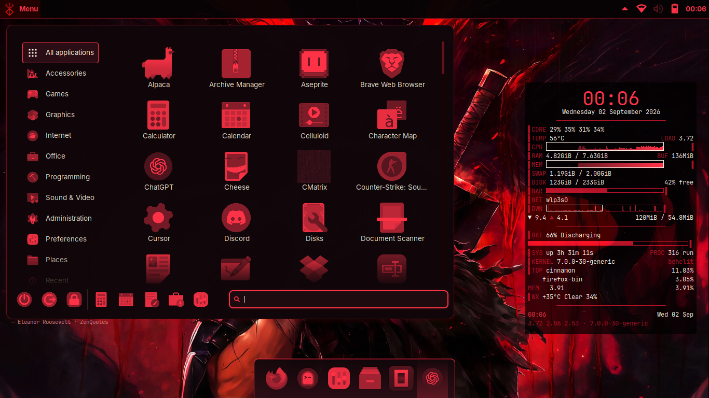
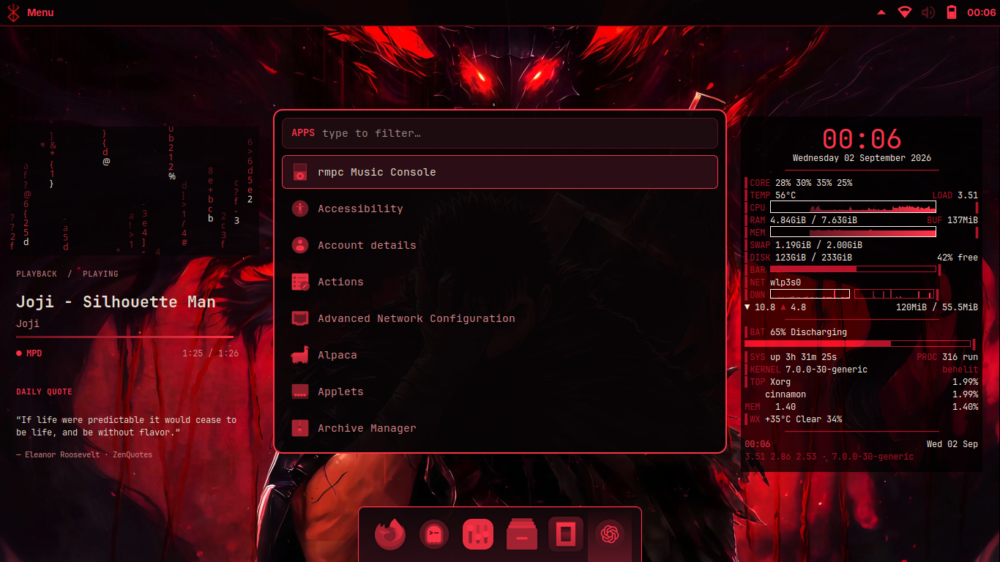
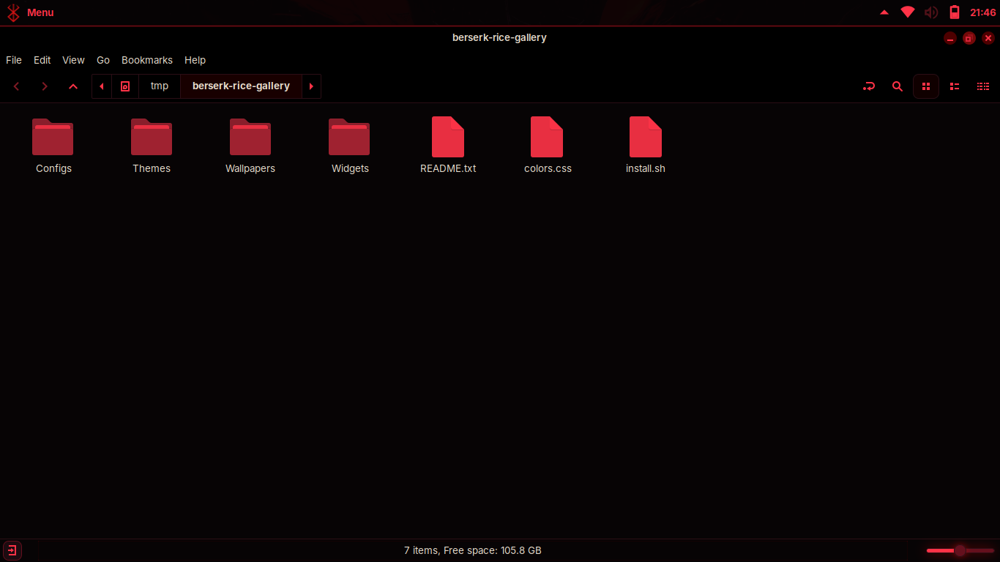

# Gallery

## Desktop

## Terminal

## Menu

## Rofi

## Files

These screenshots still match the current rice. The wallpaper and small menu
logo are personal choices, so their original files are not included as
installable assets.
